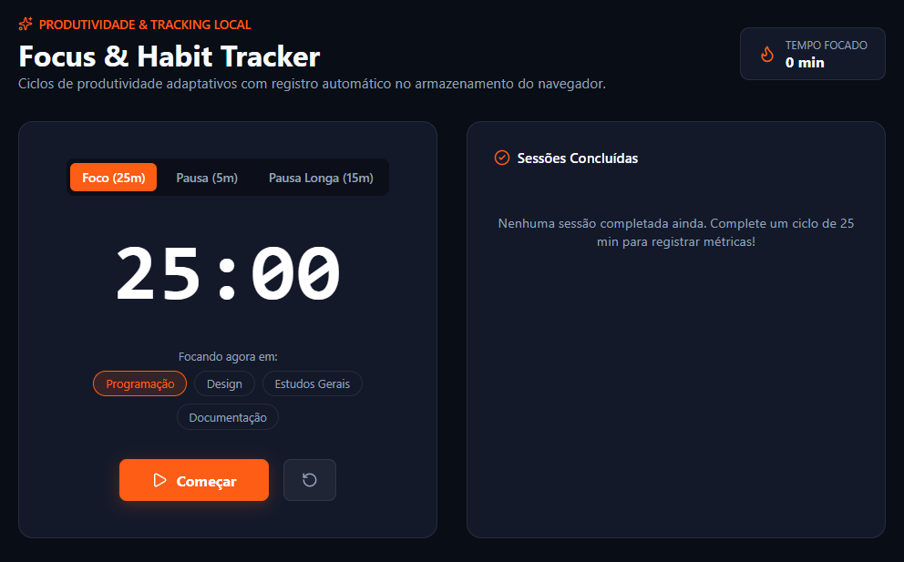

# Focus & Habit Tracker (Pomodoro Adaptativo)

> Aplicação web reativa para gerenciamento de tempo, ciclos de foco profundo e registro analítico de hábitos.

## 🎯 O Problema
A dispersão durante o desenvolvimento de software e estudos técnicos compromete o rendimento contínuo. A maioria das aplicações convencionais de timer ou exige cadastro obrigatório/planos pagos ou não oferece segmentação por categorias de estudo para análise de produtividade.

## 💡 Solução Técnica & Arquitetura
Desenvolvimento de uma solução modular em **React e TypeScript** que utiliza o armazenamento local persistente do navegador (`localStorage`) para registrar sessões de foco sem fricção:
- **Timer de Estados com Cleanups:** Gerenciamento preciso de intervalos em JavaScript (`setInterval`) com descarte seguro para prevenir vazamentos de memória (*memory leaks*).
- **Segmentação por Contexto:** Classificação de sessões (Programação, Design, Estudos, Documentação).
- **Métricas Cumulativas:** Cálculo em tempo real do tempo total investido em atividades de alto valor.

## 🛠️ Tecnologias Utilizadas
- **React**
- **TypeScript**
- **Vite**
- **Lucide React**
- **Web Storage API (localStorage)**

## ✨ Funcionalidades
- Modos Pomodoro clássico (25m), Pausa curta (5m) e Pausa longa (15m)
- Categorização de tarefas em tempo real
- Histórico dinâmico salvo no navegador
- Cálculo acumulado de tempo produtivo
- Interface dark minimalista e responsiva

## 🚀 Como Rodar Localmente

\`\`\`bash
# Clone o repositório
git clone https://github.com/joaopmartins1608/focus-habit-tracker.git

# Acesse o diretório
cd focus-habit-tracker

# Instale as dependências
npm install

# Inicie a aplicação
npm run dev
\`\`\`

---
Desenvolvido por João Pedro Padilha Martins.

## 📸 Demonstração

